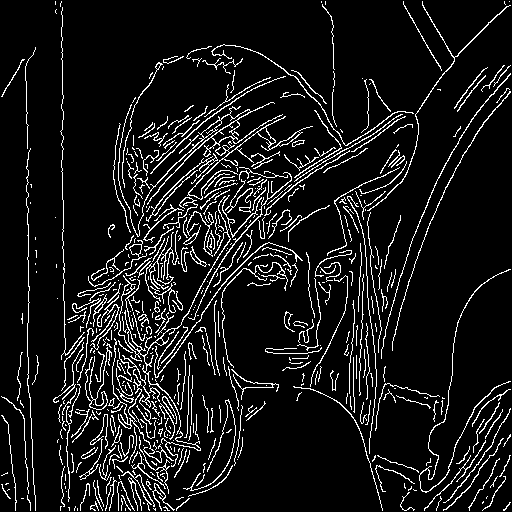
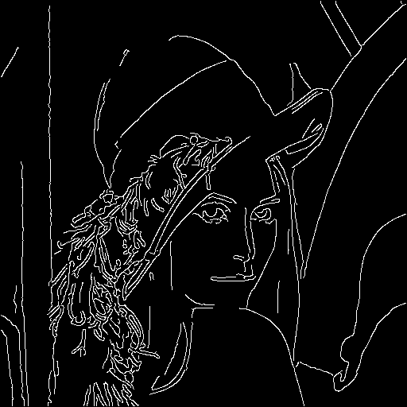
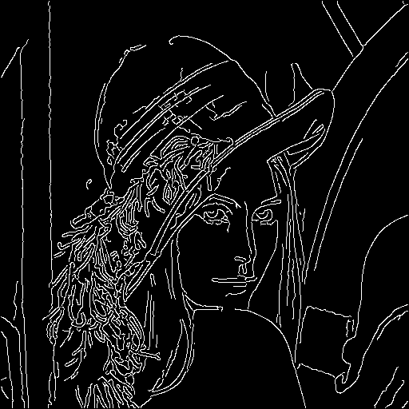
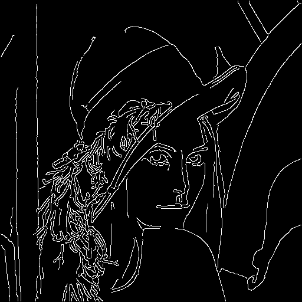

#  基于Sobel算子的Canny边缘检测算法

## 研究背景与动机

在计算机视觉和图像处理领域，**边缘检测**是一项重要的任务，其目标是在图像中准确地识别出物体的边界。边缘是图像中明显灰度变化的区域，通常表示物体的形状、纹理和结构信息，因此边缘检测对于图像分析、物体识别、目标跟踪等应用具有广泛的应用价值。

然而，由于图像中存在噪声、光照变化和纹理复杂性等因素，边缘检测一直是一个具有挑战性的问题。早期的边缘检测方法主要基于图像梯度的变化来寻找边缘，如Sobel、Prewitt和Roberts算子等。然而，这些方法对于噪声敏感，并且在检测边缘连续性和准确性方面存在一定的局限性。

因此，Canny边缘检测算法被提出，旨在克服传统方法的局限性，并提供更准确、连续的边缘检测结果。Canny算法于1986年由约翰·C·坎尼（John Canny）提出，被广泛应用于计算机视觉和图像处理领域。

尽管Canny边缘检测算法在过去几十年中得到广泛应用和研究，但随着计算机视觉和图像处理领域的不断发展，仍然存在一些研究问题和挑战。其中包括如何处理复杂背景下的边缘检测、如何提高算法的实时性能、如何适应不同图像模态和光照条件等。针对这些问题，研究人员一直在不断改进和优化Canny算法，提出了各种改进版的Canny算法，并结合其他技术手段来进一步提高边缘检测的准确性和鲁棒性。

因此，本技术报告旨在深入研究Canny边缘检测算法的原理和方法，并通过实验验证其性能和效果。通过对Canny算法的研究，我们希望能够更好地理解边缘检测问题的本质，探索解决方案，并为计算机视觉和图像处理领域的相关应用提供有益的参考和指导。

## 研究问题与挑战

在研究和应用Canny边缘检测算法的过程中，我们面临以下几个关键问题和挑战：

1. **噪声抑制**：图像中存在的噪声对边缘检测结果有很大的影响。如何在边缘检测过程中有效地抑制噪声，以提高算法的鲁棒性和准确性，是一个重要的研究问题。
2. **边缘连续性**：在一些复杂的图像场景中，边缘可能由多个不连续的片段组成，这会导致Canny算法无法正确地检测到完整的边缘。因此，如何处理边缘的间断和不连续性，以获得更连续和准确的边缘检测结果，是一个需要解决的挑战。
3. **参数选择**：Canny算法中存在一些关键的参数，如高斯滤波器的尺寸、梯度阈值等。这些参数的选择对于算法的性能和效果具有重要影响。因此，如何选择合适的参数值，以适应不同图像和应用场景的需求，是一个需要研究和解决的问题。
4. **实时性能**：对于实时图像处理和计算机视觉应用，Canny算法的计算复杂度较高，可能导致边缘检测的延迟。如何通过优化算法和实现，以提高Canny算法的实时性能，是一个需要克服的挑战。
5. **适应性和泛化性**：Canny算法在特定图像和场景下表现良好，但在其他图像和场景中可能存在一定的局限性。如何使Canny算法更具适应性和泛化性，能够处理各种图像模态、光照条件和复杂背景等，是一个值得研究的问题。

通过解决上述问题和挑战，我们可以进一步改进和优化Canny边缘检测算法，提高其性能和效果，从而更好地应用于计算机视觉和图像处理领域的各种应用中。

## 国内外相关工作

1. **Sobel算子及其改进**：Sobel算子是Canny算法中常用的梯度算子之一，用于计算图像的梯度。国内外的研究工作主要集中在改进Sobel算子的性能和效果，如基于自适应权重的Sobel算子、基于多尺度的Sobel算子等。
2. **边缘连接算法**：Canny算法的边缘连接阶段是通过连接梯度幅值高于阈值的像素来形成完整的边缘。国内外的研究工作探索了不同的边缘连接算法，如基于Hough变换的边缘连接、基于区域生长的边缘连接等。
3. **参数优化**：Canny算法中存在一些关键参数，如高斯滤波器的尺寸、梯度阈值等。研究人员致力于通过参数优化方法，如自适应阈值选择、基于统计分析的参数优化等，来改进Canny算法的性能和效果。
4. **多尺度边缘检测**：Canny算法在单一尺度上进行边缘检测，而多尺度边缘检测能够检测到不同尺度下的边缘。国内外的研究工作尝试将多尺度方法与Canny算法相结合，如基于小波变换的多尺度Canny算法、基于图像金字塔的多尺度Canny算法等。
5. **深度学习方法**：随着深度学习的兴起，研究人员开始探索将深度学习方法应用于边缘检测任务。一些相关工作致力于将深度学习模型与Canny算法结合，如使用卷积神经网络提取特征，然后使用Canny算法进行边缘检测。
6. **实时性能优化**：针对Canny算法在实时应用中的计算复杂度较高的问题，一些研究工作提出了实时性能优化的方法，如基于并行计算的加速技术、硬件加速器的设计等。

以上是一些在国内外已经开展的相关工作，这些工作对于改进Canny边缘检测算法的性能和应用具有重要的参考价值。

## Canny算法概要与详细设计

Canny边缘检测算法的**概要设计**如下：

1. **图像预处理**：首先，对输入图像进行灰度化处理，将彩色图像转换为灰度图像。
2. **高斯滤波**：应用高斯滤波器对灰度图像进行平滑处理，以减少噪声的影响。高斯滤波器的尺寸和标准差可以根据具体需求进行选择。
3. **梯度计算**：通过应用Sobel算子计算图像中每个像素的梯度幅值和方向，以获取图像中的边缘信息。
4. **非极大值抑制**：对梯度幅值图像进行非极大值抑制，即在梯度方向上对每个像素进行比较，保留局部极大值，以使得边缘变得更加细化和准确。
5. **双阈值处理**：根据设定的高阈值和低阈值，将非极大值抑制后的梯度幅值图像分为强边缘、弱边缘和非边缘三个部分。
6. **边缘连接**：通过边缘连接算法，将强边缘与与之连接的弱边缘进行连接，形成完整的边缘。

下面介绍我们对Canny算法各步骤的**具体实现**:

### 1. 高斯滤波

使用一个5x5的高斯滤波器对输入图像进行平滑处理，以减少明显噪声的影响。注：为了卷积能覆盖每一个像素，图像的边缘被以“反射”的形式补偿了两个像素，后面也有类似的操作。

> 图像变得“模糊”。

```python
def gaussian_blur(img):
    # 5x5 kernel
    gauss_mask = (
        np.array(
            [
                [2, 4, 5, 4, 2],
                [4, 9, 12, 9, 4],
                [5, 12, 15, 12, 5],
                [4, 9, 12, 9, 4],
                [2, 4, 5, 4, 2],
            ]
        )
        / 159
    )

    # Since the kernel is 2 more than the image, we pad the image with 2 using reflection
    padded = np.pad(img, 2, mode="reflect")

    out = convolve2d(padded, gauss_mask, mode="valid")

    return out
```

### 2. 计算梯度

使用Sobel算子计算图像在水平和垂直方向上的梯度。通过对图像进行卷积操作，我们可以获得每个像素点的梯度幅值和方向信息。其中幅值有**平方和开方法**和**绝对值法**，前者精度更高效率低，后者相反。工业上一般默认使用绝对值法。具体公式如下：
$$
\begin{align}
   
   G &= \sqrt{G_x^2 + G_y^2} \\
   G &= |G_x| + |G_y| \\
   \theta &= \arctan{\frac{G_y}{G_x}}
   
   \end{align}
$$

> 利用Sobel算子获得图像的梯度，计算其幅值与方向。

```python
def sobel(img, l2gradient=True):
    # Sobel operator in x direction
    sobel_x = np.array(
        [
            [-1, 0, 1],
            [-2, 0, 2],
            [-1, 0, 1],
        ]
    )

    # Sobel operator in y direction
    sobel_y = np.array(
        [
            [-1, -2, -1],
            [0, 0, 0],
            [1, 2, 1],
        ]
    )

    # Pad the image with 1
    padded = np.pad(img, 1, mode="reflect")

    # Convolve the image with the sobel operators
    dx = convolve2d(padded, sobel_x, mode="valid")
    dy = convolve2d(padded, sobel_y, mode="valid")

    # Compute the magnitude of the gradient
    if l2gradient:
        gradient_magnitude = np.sqrt(dx**2 + dy**2)
    else:
        gradient_magnitude = np.abs(dx) + np.abs(dy)

    # Compute the direction of the gradient
    gradient_direction = np.arctan2(dy, dx)

    # Normalize the magnitude of the gradient to 255
    gradient_magnitude = gradient_magnitude / np.max(gradient_magnitude) * 255

    return gradient_magnitude, gradient_direction
```

### 3. 非极大值抑制

对计算得到的梯度图像进行非极大值抑制。此步骤旨在保留具有局部最大梯度值的像素，以细化边缘。本质上，这一步骤是要找到每一个像素在其梯度方向上的两个“相邻”的像素，以判断该像素是否为局部最大值。本文实现了两种方法，下面分别介绍。

> 获得细边缘。

函数`non_max_suppresion`实现了一种朴素的非极大值抑制，将每个像素梯度的方向“归纳”到距离最近的45度角内。共有0度，45度，90度，135度，180度五个方向。对于每种方向，对比不同位置的像素。例如当一个像素梯度指向45度方向时，它将于其“右下方”和“左上方”的像素进行比较。其他方向同理。

```python
def non_max_suppresion(m, d):
    """
    m: gradient magnitude, d: gradient direction
    this function rounds the gradient direction to the nearest 45 degrees
    and checks if the pixel is a local maximum in the direction of the gradient
    """
    deg = np.rad2deg(d)
    deg[deg < 0] += 180
    deg = np.round(deg / 45) * 45

    # Create a new image of zeros with the same shape as the original image
    new_image = np.zeros_like(m)

    count = 0

    h, w = m.shape
    # Iterate over the image pixels
    for i in range(1, h - 1):
        for j in range(1, w - 1):
            direction = deg[i, j]

            if direction == 0 or direction == 180:
                is_max = m[i, j] >= m[i, j - 1] and m[i, j] >= m[i, j + 1]
            elif direction == 45:
                is_max = m[i, j] >= m[i + 1, j + 1] and m[i, j] >= m[i - 1, j - 1]
            elif direction == 90:
                is_max = m[i, j] >= m[i - 1, j] and m[i, j] >= m[i + 1, j]
            elif direction == 135:
                is_max = m[i, j] >= m[i + 1, j - 1] and m[i, j] >= m[i - 1, j + 1]

            # Count the pixels that are being pruned
            count += is_max

            # Set the pixel to 0 if it is not a maximum
            new_image[i, j] = m[i, j] * is_max

    print("non-maximum suppression:", count)

    return new_image
```

函数`non_max_suppresion_with_interpolation`则尝试了一种更加精确的方法，其精确度的提升在于不再将梯度方向粗略地“归纳”为45度角，而是采用了线性插值估计的方法。原理如下：梯度方向落入每个45度区域有两个方向可供“选择”。前文提到的朴素方法直接选择距离最近的45度方向。新方法则线性地估计两种方向的权重，并据此加权地计算出其“相邻”像素的幅值。以梯度方向在(0,45]范围上举例，显然当梯度方向更接近0度的时候“正右方”的像素权重应该更大，相反地“右下方”的像素权重则应该更小。

```python
def non_max_suppresion_with_interpolation(m, d):
    """
    m: gradient magnitude, d: gradient direction
    this function uses interpolation to check if the pixel is a local maximum
    in the direction of the gradient

    Note: this can only improve the results a little bit
    """
    deg = np.copy(d)
    deg[deg < 0] += np.pi

    new_image = np.zeros_like(m)

    count = 0

    h, w = m.shape
    for i in range(1, h - 1):
        for j in range(1, w - 1):
            direction = deg[i, j]

            # if direction equals 0
            if direction == 0:
                is_max = m[i, j] >= m[i, j - 1] and m[i, j] >= m[i, j + 1]

            # if direction belongs to (0, 45]
            elif 0 < direction <= np.pi / 4:
                r = direction
                x = (1 - np.tan(r)) * m[i, j + 1] + np.tan(r) * m[i + 1, j + 1]
                y = (1 - np.tan(r)) * m[i, j - 1] + np.tan(r) * m[i - 1, j - 1]
                is_max = m[i, j] >= x and m[i, j] >= y

            # if direction belongs to (45, 90)
            elif np.pi / 4 < direction < np.pi / 2:
                r = np.pi / 2 - direction
                x = (1 - np.tan(r)) * m[i + 1, j] + np.tan(r) * m[i + 1, j + 1]
                y = (1 - np.tan(r)) * m[i - 1, j] + np.tan(r) * m[i - 1, j - 1]
                is_max = m[i, j] >= x and m[i, j] >= y

            # if direction equals 90
            elif direction == np.pi / 2:
                is_max = m[i, j] >= m[i - 1, j] and m[i, j] >= m[i + 1, j]

            # if direction belongs to (90, 135)
            elif np.pi / 2 < direction < 3 * np.pi / 4:
                r = direction - np.pi / 2
                x = (1 - np.tan(r)) * m[i + 1, j] + np.tan(r) * m[i + 1, j - 1]
                y = (1 - np.tan(r)) * m[i - 1, j] + np.tan(r) * m[i - 1, j + 1]
                is_max = m[i, j] >= x and m[i, j] >= y

            # if direction belongs to [135, 180)
            elif 3 * np.pi / 4 <= direction < np.pi:
                r = np.pi - direction
                x = (1 - np.tan(r)) * m[i, j - 1] + np.tan(r) * m[i + 1, j - 1]
                y = (1 - np.tan(r)) * m[i, j + 1] + np.tan(r) * m[i - 1, j + 1]
                is_max = m[i, j] >= x and m[i, j] >= y

            # if direction equals 180
            elif direction == np.pi:
                is_max = m[i, j] >= m[i, j - 1] and m[i, j] >= m[i, j + 1]

            # Count the pixels that are being pruned
            count += is_max

            new_image[i, j] = m[i, j] * is_max

    print("non-maximum suppression with interpolation:", count)

    return new_image
```

### 4. 双阈值处理

对抑制后的梯度图像进行阈值处理。根据预先设定的高阈值和低阈值，按照梯度幅值像素被分为两类：梯度幅值大于等于高阈值被认为是强边缘，大于等于低阈值且小于高阈值被认为是弱边缘。小于低阈值的像素则被忽略。

> 将像素分为强弱两类，剔除以外的像素。

```python
def double_threshold(m, low_threshold, high_threshold):
    print("low_threshold:", low_threshold, "high_threshold:", high_threshold)

    weak_edges = np.zeros_like(m)
    strong_edges = np.zeros_like(m)

    # Get the weak edges
    weak_edges[np.logical_and(m >= low_threshold, m < high_threshold)] = 1

    # Get the strong edges
    strong_edges[m >= high_threshold] = 1

    return weak_edges, strong_edges
```

### 5. 边缘连接

对弱边缘进行边缘连接操作，以找到完整的边缘。该步骤采用基于像素连接的方法，将弱边缘与其相邻的强边缘像素连接起来，形成连续的边缘线。具体原理为：通过观察一个弱边缘像素和它的8个连接的邻域像素，只要其中有一个强边缘像素，这个弱边缘点就可以被确定为应该被保留的一个。这些弱边缘像素将成为强边缘，然后可以使其邻近的弱边缘像素递归地被保留下来。

> 保留与强边缘相连的弱边缘。

```python
def hysteresis(weak, strong):
    while True:
        # Get the indices of the weak edges
        indices = np.argwhere(weak > 0)
        found = False
        # Iterate over the weak edges
        for i, j in indices:
            neighborhood = strong[i - 1 : i + 2, j - 1 : j + 2]
            if np.any(neighborhood > 0):
                found = True
                # Set the weak edge to a strong edge
                weak[i, j] = 0
                strong[i, j] = 1

        # If there are no new strong edges, we are done
        if not found:
            break

    strong[strong > 0] = 255

    return strong
```

### 6. Canny算法

将上述五个步骤组合在一起便得到了Canny边缘检测算法的一种实现。该函数输入为图像、低阈值、高阈值，输出为图像边缘的二值图像。代码如下：

```python
def canny(image, low_threshold, high_threshold, interpolation=True):
    image = cv2.cvtColor(image, cv2.COLOR_BGR2GRAY)

    m, d = sobel(gaussian_blur(image))

    if interpolation:
        m = non_max_suppresion_with_interpolation(m, d)
    else:
        m = non_max_suppresion(m, d)

    weak, strong = double_threshold(m, low_threshold, high_threshold)
    edge = hysteresis(weak, strong)

    # return as uint8
    return edge.astype(np.uint8)
```

## 不同阈值对检测结果的影响

对于Canny边缘检测算法的阈值，经验上通常设置低阈值为高阈值的1/3~1/2。对经典的**莱娜图**进行边缘检测，遍历0到255为高阈值。

测试代码如下：

当低阈值为高阈值的1/2，效果如下：

（从左到右分别是：高阈值20，高阈值40，高阈值60，高阈值80）

|  |  |  |  |
| :----------------------------------------------------------: | :----------------------------------------------------------: | :----------------------------------------------------------: | :----------------------------------------------------------: |

当低阈值为高阈值的1/3，效果如下：

（从左到右分别是：高阈值20，高阈值40，高阈值60，高阈值80）

|  |  |  |  |
| :----------------------------------------------------------: | :----------------------------------------------------------: | :----------------------------------------------------------: | :----------------------------------------------------------: |

### 小结

阈值比例对输出结果影响不大，仅有极其细微的差别，即相同高阈值检测结果几乎一样。

随着高阈值的增大，边缘越来越稀疏。这是符合直觉的。

注：对于各种各样的图像，很难找到一个通用的“合适的”阈值，因此具有一定的局限性。

## Canny算法与边缘检测在现实中的应用

Canny边缘检测算法是计算机视觉和图像处理领域中广泛应用的算法之一。它在许多现实世界的应用中发挥着重要作用，以下是一些Canny算法和边缘检测在现实中的应用示例：

1. **目标检测和跟踪**：边缘检测是目标检测和跟踪的重要预处理步骤。通过提取图像中物体的边缘信息，可以帮助识别和跟踪目标，例如在视频监控中实时检测人体、车辆等物体。
2. **图像分割**：边缘检测有助于将图像分割为不同的区域或对象。通过检测图像中的边缘，可以在医学图像分析、图像分割和计算机视觉任务中有效地提取出感兴趣的区域。
3. **图像增强**：通过突出显示图像中的边缘，边缘检测可以改善图像的视觉质量和观感。这在图像增强、艺术和图像编辑等领域中得到广泛应用。
4. **物体识别和形状分析**：边缘检测可用于物体识别和形状分析任务。通过提取物体的边缘信息，可以进行形状匹配、对象识别和图像分类等任务。
5. **机器视觉和自动驾驶**：Canny算法及其改进版本在机器视觉和自动驾驶领域中被广泛应用。边缘检测可用于道路线检测、障碍物检测、车道保持和车辆边缘检测等任务，为自动驾驶系统提供关键的视觉信息。
6. **工业检测和质量控制**：边缘检测在工业领域中常用于检测产品的缺陷、边缘对齐和精确测量。例如，在半导体制造中，边缘检测可用于检测芯片的缺陷和形状精度。
7. **医学图像处理**：Canny算法和边缘检测在医学图像处理中发挥着重要作用，如边缘提取、病变检测、血管分析和组织边缘识别等任务。

这些仅是Canny算法和边缘检测在现实中应用的一些示例，它们展示了Canny算法的广泛应用领域和重要性。

## 效果展示

|  |  |
| :------------------: | :--: |
|  |  |
|  |  |
|  |  |


## 软件配置及用法

算法使用python实现，演示/调试则使用jupyter notebook

算法依赖见目录下`requirements.txt`

各依赖用途如下：

- numpy（对图像信息进行操作）
- opencv_python（读取、写入图像）
- scipy（卷积操作）

在依赖安装完备的情况下：

- 执行`python my_canny.py <path-to-image> <low_threshold> <high_threshold>`将在当前目录生成`out.png`为边缘检测的结果。

## 文件结构

- `images`下为各输入样例和对应的检测结果。
- `images/lena`下为遍历高阈值对莱娜图进行边缘检测得到的结果。
- **算法实现**见`my_canny.py`。

## 总结

本文的**主要工作**是基于Python**实现了经典的Canny边缘检测算法**，并围绕这一主题展开了技术报告的撰写。在研究背景与动机部分，我们阐述了边缘检测在计算机视觉和图像处理中的重要性，以及Canny算法作为一种经典方法的背景和动机。在研究问题与挑战部分，我们提出了Canny算法在实际应用中面临的问题和挑战，如噪声干扰和参数选择等。接着，在国内外相关工作部分，我们回顾了国内外关于Canny算法和边缘检测的相关研究工作，为本文的实现工作提供了背景和参考。然后，我们**详细描述了Canny算法的概要设计和详细设计**，包括图像预处理、高斯滤波、梯度计算、非极大值抑制、双阈值处理、边缘连接和输出结果等步骤。在实验方法和实验结论分析部分，我们介绍了实验的方法和步骤，并对实验结果进行了分析和讨论。最后，我们总结了本文的工作，强调了Canny边缘检测算法的实现和应用价值，并指出了未来改进的方向和研究的重要性。

## 参考文献

*[1] Canny, J. (1986). A Computational Approach to Edge Detection. IEEE Transactions on Pattern Analysis and Machine Intelligence, 8(6), 679-698.*

*[2] Wikipedia. (n.d.). Canny edge detector. In Wikipedia, The Free Encyclopedia. Retrieved June 8, 2023, from https://en.wikipedia.org/wiki/Canny_edge_detector*

*[3] Wikipedia. (n.d.). Sobel operator. In Wikipedia, The Free Encyclopedia. Retrieved June 8, 2023, from https://en.wikipedia.org/wiki/Sobel_operator*

